# Recon-V00: Job Intelligence & Company Research Tool


Recon is an automated, AI-powered pipeline that drastically speeds up interview preparation and company intelligence gathering. By leveraging local LLMs (via Ollama) and advanced web scraping, the tool autonomously digests company websites, parses Job Descriptions (JDs), matches applicant resumes, and aggregates repeatedly asked DSA/System Design interview questions from across the web.

---

System Arch


---
## Key Features
- **Autonomous Company Scraping**: Dynamically discovers XML sitemaps and scrapes company websites to extract Mission, Products, Launches, and Hiring Signals.
- **JD & Resume Analysis**: Evaluates resume-to-JD match scores, identifies missing skills, and checks role competencies.
- **Dynamic Research Configuration**: Uses `job_sources.json` to configure target domains (e.g., Reddit, LinkedIn, Glassdoor) and automatically perform real-time web searches to ground the AI with live context, drastically reducing hallucinations.
- **Local AI Processing**: Uses Ollama (defaulting to the highly efficient `phi3:latest`) for fast, secure, and cost-free local text analysis.
- **Strict Data Validation**: Utilizes Pydantic schemas to ensure all AI outputs are heavily structured and strictly typed.
- **Rich Markdown Reports**: Automatically generates beautifully formatted `.md` and `.json` reports containing role alignment, team size estimates, and historically repeated interview questions.

---

## Technical Specifications & Methodology

### Core Technologies
- **Programming Language**: Python 3.13
- **Data Validation**: Pydantic (Strict typing and LLM schema enforcement)
- **Local AI Engine**: Ollama (Offline execution, zero API costs, privacy-first)
- **Web Scraping**: BeautifulSoup4, Requests, Firecrawl API v2

### System Methodology
1. **Target Discovery & Aggregation**: The pipeline begins by analyzing the target company's XML sitemap to discover public URLs. It dynamically filters and scrapes high-signal pages (e.g., About Us, Careers, Product lines) using BeautifulSoup and Requests.
2. **Contextual AI Processing**: The scraped HTML is stripped of noise and fed into a locally hosted LLM via Ollama (`OLLAMA_MODEL` defined in `.env`). The model is strictly bound by predefined Pydantic JSON schemas (`structured_chat`) to extract specific data points such as the company's mission, recent launches, and competitor analysis.
3. **Candidate Alignment Engine**: User-provided resumes and Job Descriptions (PDFs) are parsed. The LLM evaluates the candidate's skills against the JD, detecting missing competencies, matching strengths, and calculating an alignment score.
4. **Historical Interview Intel Extraction**: Recon queries external platforms (Reddit, LeetCode, Glassdoor) via Serper API. It then uses the Firecrawl API to deep-scrape discussion threads, aggregating and categorizing the most frequently asked Data Structures & Algorithms (DSA) and System Design questions for that specific role.
5. **Report Generation**: All validated outputs are synthesized into comprehensive JSON data dumps and human-readable Markdown (`.md`) reports.
---

## Prerequisites

1. **Python 3.13+** installed on your system.
2. **[Ollama](https://ollama.com/)** installed and running locally.
3. Download the default model via Ollama (or whichever you set in `.env`):
   ```bash
   ollama run phi3
   ```
4. Get your API Keys for search/scraping tools (Firecrawl/SerpAPI).

---

## Installation & Setup

1. **Clone the repository:**
   ```bash
   git clone https://github.com/your-username/Recon.git
   cd Recon-V00
   ```

2. **Create and activate a virtual environment:**
   ```bash
   python -m venv venv
   # On Windows:
   venv\Scripts\activate
   # On Mac/Linux:
   source venv/bin/activate
   ```

3. **Install Dependencies:**
   ```bash
   pip install -r requirements.txt
   ```

4. **Configure Environment Variables:**
   Create a `.env` file in the root directory and add your keys:
   ```env
   OLLAMA_MODEL=qwen2.5:14b
   SERP_API_KEY=your_serp_api_key_here
   FIRECRAWL_API_KEY=your_firecrawl_api_key_here
   ```

5. **Add Resumes and JDs:**
   Place any target resumes or Job Description PDFs into the `Resumes&JD/` folder.

---

## Usage

### 1. Interactive Mode
Run the tool and follow the CLI prompts to input specific company details, paths to resumes, and JDs.
```bash
python main.py
```

### 2. Test Mode (Quick Start)
The project comes with a built-in test mode that executes a pre-configured pipeline using placeholder documents (e.g., Swiggy Gen-AI Intern role).
```bash
python main.py --test
```

### Output
The execution will produce two files inside the `reports/` directory:
1. `Company_Name_YYYYMMDD_HHMMSS.json` (Raw structured data)
2. `Company_Name_YYYYMMDD_HHMMSS.md` (Rich, human-readable markdown report)

---

## Project Structure
```text
Recon-V00/
├── Company_Specific/     # Logic for parsing sitemaps and extracting company context
├── Job_Specific/         # Prompt engineering, JD vs Resume matching, and DSA/Interview scraping
├── Search/               # Serper / Firecrawl API wrappers
├── Utils/                # Configs, Resume loading, and Ollama HTTP clients
├── reports/              # Auto-generated JSON and Markdown reports
├── Resumes&JD/           # (Ignored) Directory for local resumes and target JDs
├── main.py               # Application entry point & orchestration
├── report_engine.py      # Markdown & JSON output generation
└── pydantic_models.py    # Strict structural schemas for LLM validation
```

---

## Documentation
For an in-depth breakdown of the project architecture, day-by-day development progress, and engineering decisions, please view:
- [Day 1 Project Documentation](PROJECT_DOCUMENTATION.md)
- [Day 2 Project Documentation](PROJECT_DOCUMENTATION_DAY2.md)

---

## Contributing
Contributions, issues, and feature requests are welcome. Feel free to check the issues page or fork the repository to submit your own pull requests.
